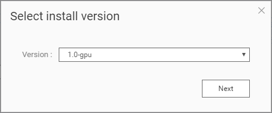

# Object Detection API on Tensorflow for Demo

## Main Repositories

DockerHub : <https://hub.docker.com/u/qhub> 

Github : <https://github.com/qpjkw/tfod_ces2019.git>

Tensorflow Object Detection API : <https://github.com/tensorflow/models/tree/master/research/object_detection>

## Build container images

Make sure you have already imported the customized docker image into container station. You can pull images from Dockerhub repository. In this tutorial, we recommend GPU-based docker image.

### CUDA 9 :
```bash
docker pull qhub/tfod-ces2019:1.0-gpu
```

### CUDA 10  :
Download dockerfile and put to NAS `Public` folder  :  [DockerFile-CUDA10](DockerFile-CUDA10/Dockerfile-GPU)

```bash
cd /share/Public
docker build --rm --tag=qhub/tfod-ces2019:1.13-gpu --file=Dockerfile-GPU .
```

## Starting a container
### Use command
And then instantiate a container via the below command.

#### CUDA 9 : 

```bash
docker run --rm -it --name ces2019gpu --ipc=host -p 28888:8888 -p 26006:6006 --device /dev/nvidia0:/dev/nvidia0 --device /dev/nvidiactl:/dev/nvidiactl --device /dev/nvidia-uvm:/dev/nvidia-uvm -v /share/CACHEDEV1_DATA/.qpkg/NVIDIA_GPU_DRV/usr/:/usr/local/nvidia qhub/tfod-ces2019:1.0-gpu
```

#### CUDA 10 :

```bash
docker run --rm -it --name ces2019gpu --ipc=host -p 28888:8888 -p 26006:6006 --device /dev/nvidia0:/dev/nvidia0 --device /dev/nvidiactl:/dev/nvidiactl --device /dev/nvidia-uvm:/dev/nvidia-uvm -v /share/CACHEDEV1_DATA/.qpkg/NVIDIA_GPU_DRV/usr/:/usr/local/nvidia qhub/tfod-ces2019:1.13-gpu
```

### Use web GUI

#### CUDA 9 : 

1. Search docker image from **Docker Hub**


2. Choice docker image tag (version)


3. Change page to **"Advanced Settings"**


4. Setting port forwarding


5. Mount GPU card


6. Created container


#### CUDA 10 : 

1. Switch to **images** page and create `qhub/tfod-ces2019:1.13-gpu` container


2. Switch page to **Advanced Settings**


3. Setting port forwarding


4. Mount GPU card


5. Created container


You now can surf the web link to use jupyter notebook (online IDE). 
**http://\<IP\>:28888/?token="(fetch from terminal)"**


## Training

The `/object_detection/data` folder contains the training dataset (`train.tfrecords`) and the validation dataset (`val.tfrecords`) after preprocessing (classification mark and encoding into TFRecord format).

Script reference : <https://github.com/qpjkw/tfod_ces2019/blob/master/object_detection/start_object_detection.sh>

Executing `start_object_detection.sh` will first:
1. Generate training config (`set_training_configuration.py`) for Dataset pre-processing
2. Execute Tensorboard to view the training status (`start_tensorboard.sh`)
3. Start retraining. (`model_main.py`)
4. Generate new **model** + **labelfile**

Execute the bash script to start a training. 
You can open a terminal by clicking the buttons [**new > terminal**].
After you open a terminal, copy the below command and paste on it to start a retraining task.


```bash
bash /notebooks/object_detection/start_object_detection.sh
```

You now can surf the web link to monitor training progresses via Tensorboard.

**http://\<IP\>:26006"**


After the training, you can find the model (.pb) on `/notebooks/object_detection/model`.

**If you stop the training unexpectedly, you can type the above starting training command to continue the training.**

## Inference

Back to jupyter notebook editor, you can edit the notebook `object_detection_demo.ipynb` to demo the object detection on images (the below image is the example).


